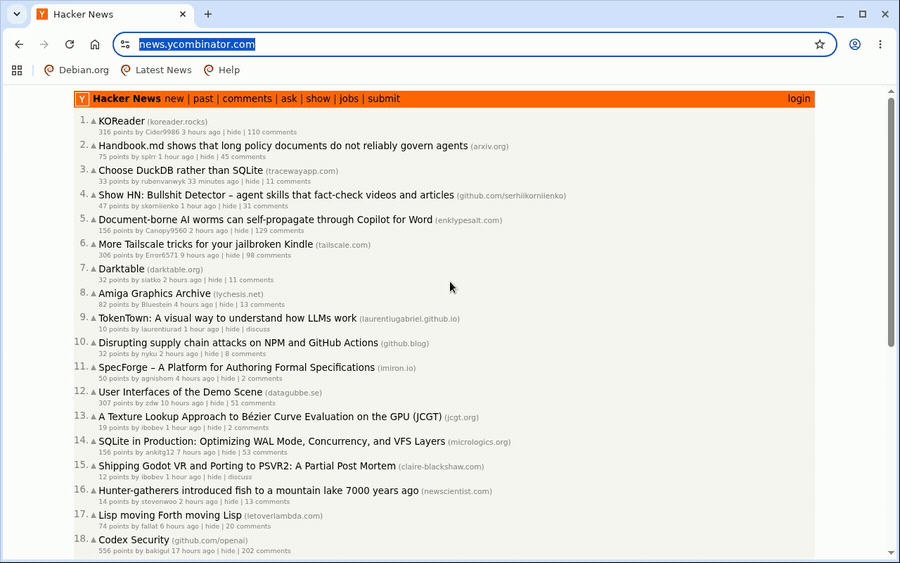

# sidekick

**A self-hosted sidekick server for your AI agent — not rented by the second.**
Your agent deploys one persistent machine it can drive and come back to: a
scriptable Chromium browser, a live watch-along view, and a shell/exec API,
all over a free Cloudflare Tunnel. No inbound ports, no SSH, no per-second bill.

[](LICENSE)
[](https://github.com/eladb/sidekick/pkgs/container/sidekick)
[](https://github.com/eladb/sidekick/actions/workflows/publish.yml)

- **Designed for agents.** One token is all your agent needs — hand it over as
  `SIDEKICK_TOKEN` and it reconnects to the same browser and shell from any
  future session. CDP for Playwright/Puppeteer, plus a clean `/exec` API.
- **Self-hosted, not rented.** Runs on *your* fly.io, EC2, Hetzner, or Docker
  host — no SaaS, no per-second billing, no vendor lock-in. A free Cloudflare
  quick tunnel is the only ingress: no inbound ports, no SSH.
- **Watch it work.** A live watch-along view (noVNC) opens in any browser tab —
  see the agent drive Chromium in real time, even on hosts with no public IP.

## Why

AI agents increasingly run in the background on hosted cloud environments —
they spin up, do work unattended, and spin down. Those environments are
deliberately bare-bones and sandboxed: no real web browsing, and nothing that
installs or stays running for long. The common workaround is to move the agent
into a full sandbox service that gives it a whole managed VM to live in.

sidekick takes the leaner path: leave the agent in the zero-setup environment it
already runs in, and attach one self-hosted companion box that adds *only* the
two missing pieces — a real Chromium the agent can drive, and a shell/exec for
long-running installs and services. The agent deploys it once, gets back a
single token, and reconnects to the same box from any future session. Everything
rides a free Cloudflare quick tunnel, so it works even on hosts with no public
IP and nothing to SSH into — and you can watch it work live from a browser tab.

## Demo

> **TODO (pre-launch):** drop a GIF/asciicast here. Two clips land best:
> (1) `scripts/install.sh --platform fly` running end-to-end to the printed
> token, and (2) the **watch-along** view showing the agent driving Chromium
> live. A short (~15s) loop of the watch-along is the single highest-value
> asset for the Show HN post.

<!--  -->

## Quickstart

```bash
git clone https://github.com/eladb/sidekick.git
cd sidekick
scripts/install.sh --platform fly    # or: ec2 | hetzner | docker
```

This deploys the server, waits for its tunnel to come up, and prints one
big token to your terminal (and saves it to `sidekick-token.txt`,
gitignored). Give that token to your agent — as `SIDEKICK_TOKEN` in its
env/secrets — and it's everything the agent needs to reconnect to this same
server from any future session, from anywhere.

```bash
scripts/install.sh --platform ec2       # AWS, no SSH key needed
scripts/install.sh --platform hetzner   # Hetzner Cloud, no SSH key needed
scripts/install.sh --platform docker    # any Docker host you already have
```

Required tooling per platform: `FLY_API_TOKEN` (env) + `python3` for fly.io,
`aws` (configured) for EC2, `hcloud` + `cloudflared` + `python3` for Hetzner,
`docker` for the Docker path. Each script fails fast with a clear message if
its dependency is missing. (fly.io is driven straight through the fly Machines
API — no `flyctl` needed, just a token like Hetzner's `hcloud`. Hetzner needs
`cloudflared` because it has no text console to scrape — the box reports its
URL back over a return-path tunnel the installer runs; see the note in "Known
limitations".)

## The token

The token is `base64url(JSON)`. Decoded, it looks like:

```json
{
  "v": 1,
  "server_id": "a1b2c3d4e5f6a7b8",
  "base_url": "https://xxxx.trycloudflare.com",
  "auth_token": "…",
  "cdp_url": "https://sidekick:…@xxxx.trycloudflare.com",
  "watch_url": "https://xxxx.trycloudflare.com/vnc.html?autoconnect=true&reconnect=true&token=…",
  "shell_url": "https://sidekick:…@xxxx.trycloudflare.com/shell",
  "exec_url": "https://sidekick:…@xxxx.trycloudflare.com/exec",
  "platform": "fly",
  "created_at": "2026-07-14T00:00:00Z"
}
```

Every service is gated by the same secret (`auth_token`), so each `*_url` is
ready to use as-is. The programmatic URLs (`cdp_url`, `shell_url`, `exec_url`)
embed it as HTTP Basic Auth (username `sidekick`); the `watch_url` carries it as
a `?token=` query param instead, because it's meant to be opened in a browser
and browsers strip the credentials from `user:pass@host` URLs.

- **`cdp_url`** — point Playwright/Puppeteer at this
  (`chromium.connectOverCDP(cdp_url)`) to drive the remote browser.
- **`watch_url`** — a plain clickable link (token in the query string); open it
  in a browser tab to watch the browser live (noVNC), no login prompt.
- **`shell_url`** — open in a browser tab for an interactive terminal
  (ttyd), or drive it programmatically over its WebSocket protocol.
- **`exec_url`** — `POST` `{"cmd": "...", "cwd": "...", "timeout_sec": ...}`
  for clean programmatic command execution; `cmd` runs through a shell
  (`bash -lc`), so pipes, `&&`, and redirection work. Response is
  newline-delimited JSON: `{"stream":"stdout"|"stderr","data":"..."}` lines
  followed by `{"exit_code": N}`.

**The token is a root-equivalent bearer credential.** Anyone who has it can
run arbitrary commands on the box. Treat it exactly like an SSH private key
or a cloud API key — store it in a secrets manager / your agent's encrypted
env, never commit it, never paste it somewhere public.

## Architecture

One `provision.sh` installs everything with plain `apt-get` (Chromium,
Xvfb/openbox, x11vnc + noVNC/websockify, ttyd, a small `execd` service,
Caddy, cloudflared); `configure-and-start.sh` then renders the runtime config
from the secrets and starts supervisord. That split — install (no secrets) vs
configure (secrets, at start) — is the whole trick: the same `provision.sh`
feeds two delivery models, and secrets are never baked into an image.

- **Container platforms (fly.io, Docker)** pull a **prebuilt image**
  (`ghcr.io/eladb/sidekick`, built from the `Dockerfile` by GitHub Actions on
  every change to the image inputs). fly boots it in ~1-2 min; the image's
  entrypoint runs `configure-and-start.sh` with the secrets injected at runtime.
- **Bare-VM platforms (EC2, Hetzner)** run `provision.sh` at first boot via
  cloud-init, straight onto the OS — no container runtime on the box.

fly.io defaults to the image but also accepts `SIDEKICK_FROM_SOURCE=1` to boot a
stock `debian:bookworm-slim` and install from source at boot instead (~10-12 min
on fly's shared CPUs — handy for hacking on `provision.sh` from a branch). So no
platform is locked to a published artifact, and the bare-VM path needs no
registry at all.

Cloudflare's free quick tunnel (`cloudflared tunnel --url ...`) is the only
ingress path — no inbound ports are opened anywhere, which is also why none
of the platform scripts use SSH: there's nothing to SSH into from the
outside, and the box needs no SSH out either. The interactive shell
(`ttyd`) and exec API (`execd`) exist specifically to give an agent
SSH-equivalent access over that same HTTP(S)/WebSocket tunnel.

Caddy fronts everything on port 80 behind the tunnel:

| Path                     | Backend            | Auth                          |
|---------------------------|---------------------|-------------------------------|
| `/healthz`                | —                   | none                          |
| `/json*`, `/devtools/*`   | Chromium CDP (9222) | Caddy `basicauth`             |
| `/exec`                   | execd (8090)        | checked by execd itself       |
| `/shell*`                 | ttyd (7681)         | checked by ttyd itself        |
| everything else (root)    | noVNC (6080)        | Caddy `?token=` + cookie      |

CDP is deliberately **not** proxied under a prefix like `/cdp`: Chrome's
DevTools endpoint reports its own paths (`/json/version`,
`/devtools/browser/<id>`) at the root with no way to tell it about a
reverse-proxy prefix, so prefixing would break the client's follow-up
WebSocket connection. The noVNC viewer likewise lives at the root
(`/vnc.html` + its assets + the `/websockify` WebSocket). `/exec` and
`/shell` don't have that problem (execd is ours, and ttyd supports
`--base-path`), so they get real prefixes.

## Watch-along

The live viewer is **x11vnc + noVNC/websockify**: x11vnc exposes the
Chromium display (`:99`) as VNC on localhost, and websockify serves the
noVNC web client and bridges the browser's WebSocket to it. This streams
over a single WebSocket that traverses the Cloudflare tunnel on **every**
platform — including ones with no public IP (fly.io, sandboxed "cloud
container" agent environments) — with no STUN/TURN and no GStreamer. noVNC has
no auth of its own, so Caddy gates it — but **not** with `basic_auth`: the
`watch_url` is pasted into a browser, and browsers strip the credentials from
`user:pass@host` URLs, so an embedded-credential link silently fails. Instead
Caddy validates a `?token=<auth_token>` query param on the first load and stamps
it into a cookie; the noVNC assets and the `/websockify` WebSocket then
authenticate via that cookie (cookies ride the same-origin WS upgrade), so the
link works in any browser with no prompt.

(An earlier design used Selkies for lower-latency WebRTC streaming, but the
shipping Selkies build requires a heavy GStreamer stack and a TURN relay for
its media path to cross the tunnel; noVNC is the simpler, tunnel-native
choice.)

## Known limitations

- The Cloudflare **quick tunnel URL is stable only as long as the process
  doesn't restart** — a crash/restart gets a new `trycloudflare.com`
  subdomain, invalidating the token's `base_url`. A named Cloudflare Tunnel
  (stable hostname, requires a free Cloudflare account) is the natural
  upgrade path here and may land later.
- **Hetzner uses a return-path rendezvous for URL discovery.** Hetzner
  exposes only a *graphical* VNC console — no text console API — so the
  installer can't scrape the tunnel URL from logs the way it can on
  Docker/fly/EC2. Instead the installer runs a tiny receiver behind its own
  ephemeral `cloudflared` tunnel and the box POSTs its URL back
  (`scripts/lib/rendezvous.sh`). This means the Hetzner installer must run
  somewhere with outbound reach to Cloudflare's edge (TCP/UDP 7844); in a
  locked-down sandbox that blocks it, run the Hetzner deploy from a host with
  open egress. Docker and fly.io don't need this — they read logs directly.
- **EC2 URL-discovery reads the serial console** via `aws ec2
  get-console-output --latest` (the `--latest` flag is required — on Nitro
  instance types, i.e. essentially all current ones, the non-latest form
  returns an empty snapshot). It isn't real-time, so discovery can lag a minute
  or two after the box is actually up; the installer waits accordingly.
- Debian 12 is the target OS (Ubuntu's `chromium-browser` package is a snap
  wrapper that doesn't work in a container or a minimal cloud-init install).
- The watch-along view is video-only (no audio); noVNC/VNC doesn't carry
  audio.

## Roadmap

More services are planned to run alongside the browser on the same box —
starting with a Caddy-hosted webapp/CGI server — reusing the same
`provision.sh` + supervisord + token pattern established here.
